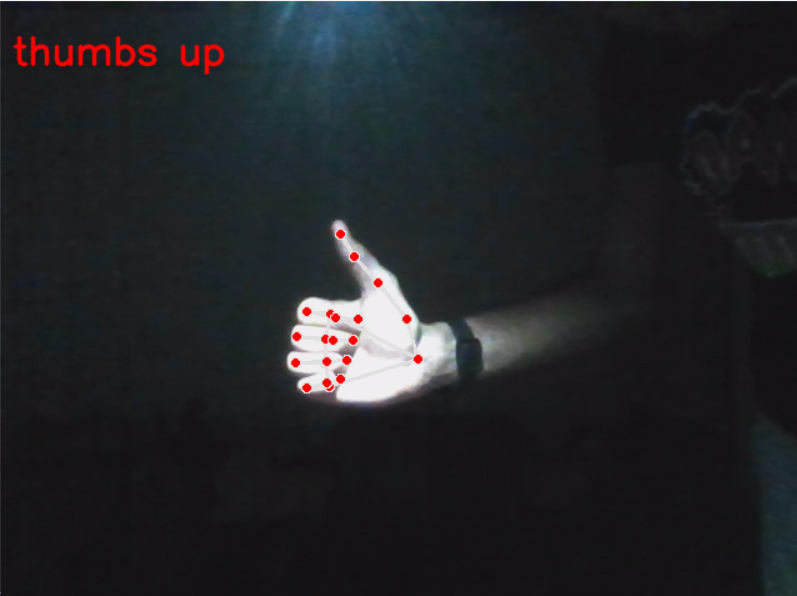
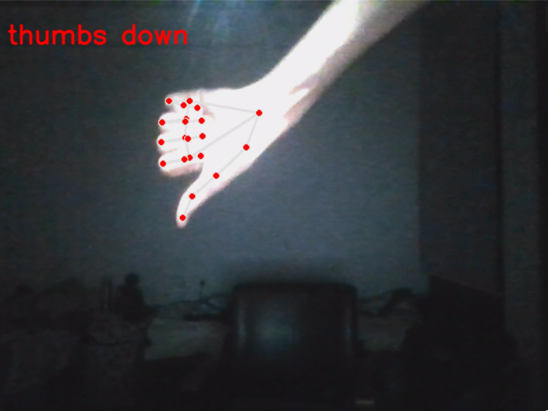
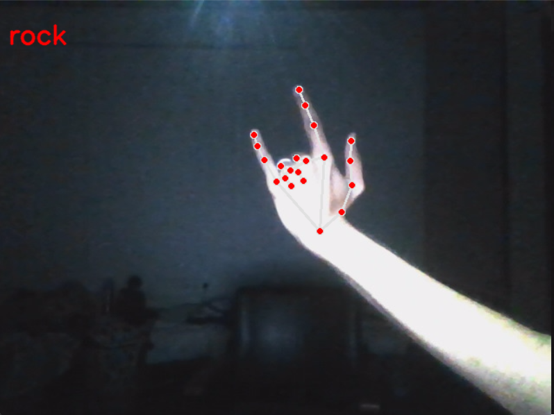
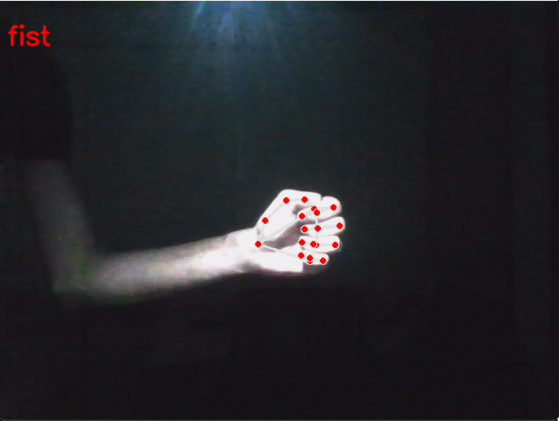

#Basic hand gesture detector with mediapipe and tensorflow

This project is based on detecting a few simple hand gesture such as 'Stop','Rock and roll','Thumbs up','Thumbs down' and so on

Unfortunately, as very few conv layers were used, the model is not quite accurate, but with the addition of 2-3 conv layers and some more training, the model can be expanded to applications such as ASL or even gestures for the device to act upon.

This model was pre-trained and may be retrained using new user data

