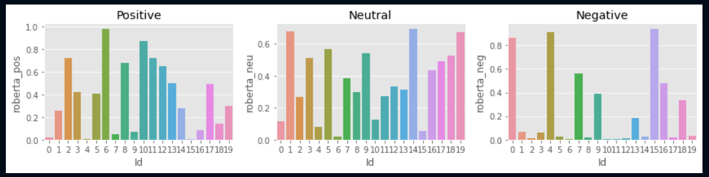

#Twitter Sentiment Analysis with RoBERTa

What I have done in this project is essentially use the twitter API to request the last 20 tweets of a random user in my case CardinalSama (one of my friends, I took his permission) and run the RoBERTa model to determine the sentiment of the tweets.

Unlike the VADER model however, this model is relatively more successful in categorising the tweets correctly. However certain tweets having sarcasm or satire don't work as well.

