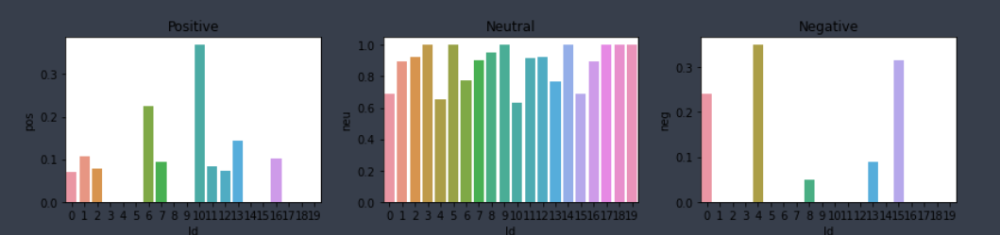

#Twitter Sentiment Analysis with VADER

What I have done in this project is essentially use the twitter API to request the last 20 tweets of a random user in my case CardinalSama (one of my friends, I took his permission) and run the VADER model to determine the sentiment of the tweets.

However as you will can see in the graphic, this is very rudimentary and is classing most of his posts as neutral where they are clearly positive or negative.

This is where VADER falls short, while being a relatively simple model, and reliablein shorter reviews / ratings system, it ultimately falls short while dealing with larger, more complex sentences.

For such cases models such as RoBERTa are much better
